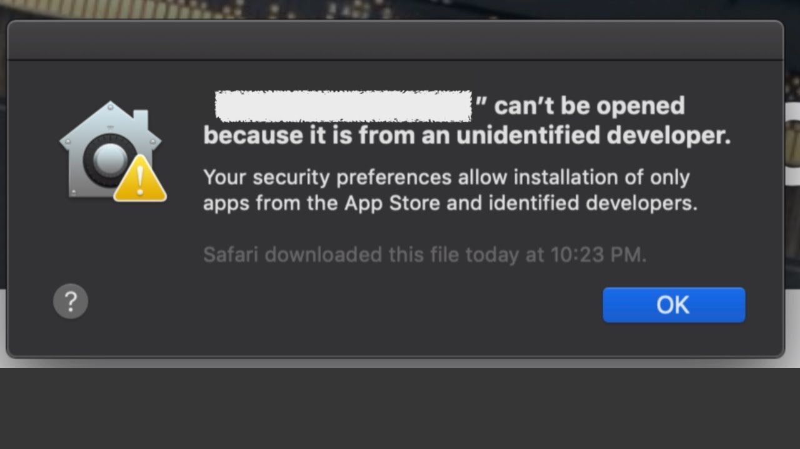
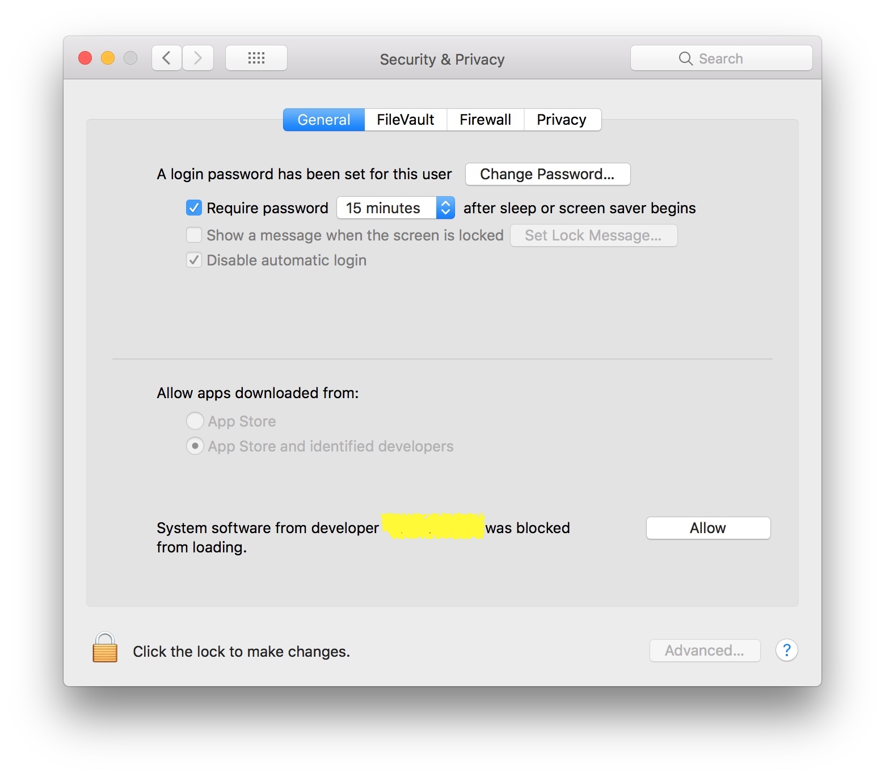

# Code Sign Issue

Since I don't have a valid developer account for Apple & Windows platform, the pre-build binary is unsigned or has been signed using an "invalid" singing certification.

You might see errors like "This APP is from an untrusted / unidentified developer and has been blocked." on Apple / Windows operating system.

## Windows

When you see prompts like this, you might need to click on the "More info" button then click on the "Run anyway" button to run Clashy.

## Mac

You will see prompt like below on macOS when you trying to open an Application from an unindentifiied developer. 

In order to run this you need to open "System Preference" then go to "Security & Privacy" section.

Click on "Allow" button to open your blocked application.

## How to resolve this issue permanently?

Once I got enough donation to purchase developer membership on Apple & Windows platform.